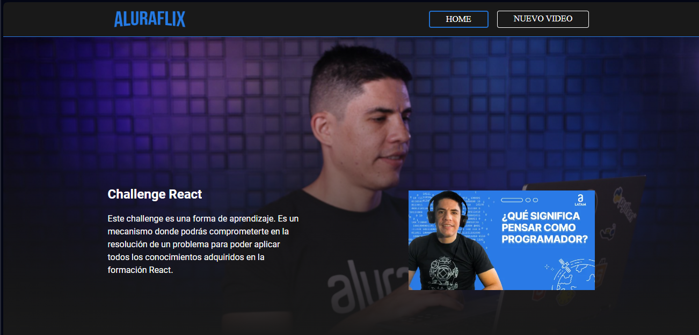

## Descripción del proyecto  

AluraFlix es un proyecto desarrollado como parte del reto del programa de Oracle Next Education y Alura Latam. Esta aplicación web permite realizar operaciones CRUD (Crear, Leer, Actualizar, Eliminar) sobre videos de YouTube, organizándolos por categorías para facilitar su gestión y exploración.

   
## Funcionalidades del proyecto 
- `Funcionalidad 1:`: Listado, registro, actualización y elimnación de categorias
- `Funcionalidad 1:`: Listado, registro, actualización y elimnación de videos 

